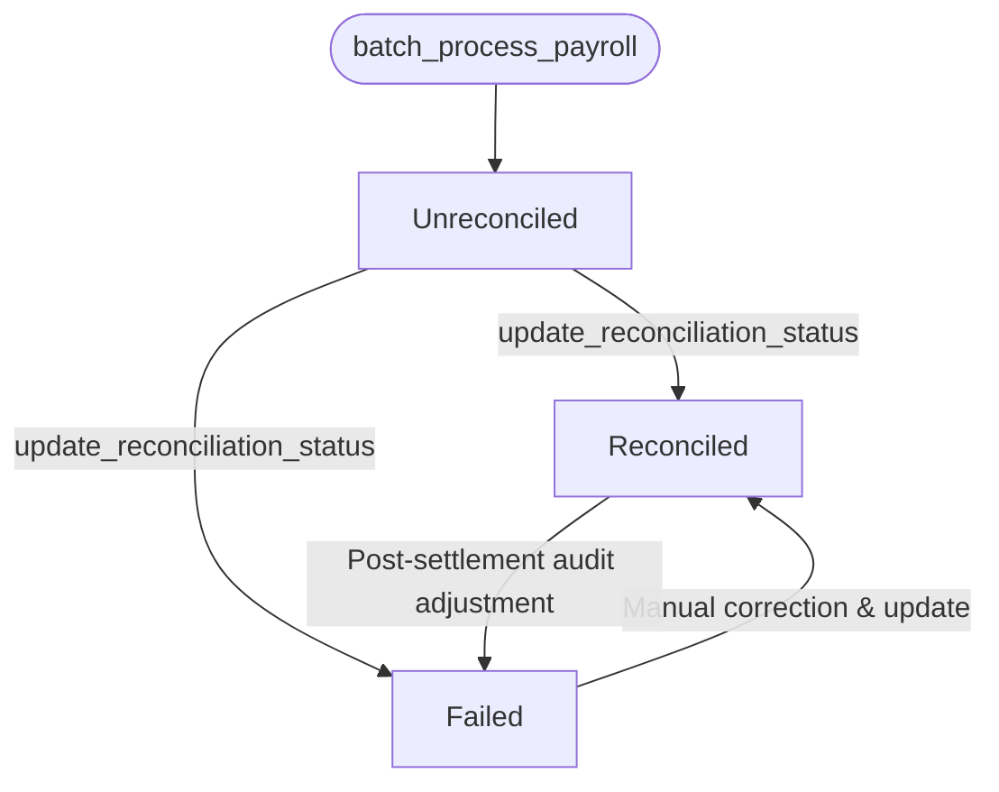

# Payroll Run Reconciliation Status — Issue #134

This document defines the reconciliation states, state transitions, and integration guidelines for downstream systems tracking completed payroll runs.

---

## Background

On-chain payroll execution is the first phase of the payment lifecycle: funds are transferred to employee addresses. However, downstream business systems (ERPs, general ledgers, sub-ledgers, and off-chain bank gateways) require a way to verify and log whether the executed payroll run has been fully settled and reconciled.

The payroll contract exposes a `reconciliation_status` field on `PayrollRun` records and provides an admin entry-point to update this status.

---

## Reconciliation States

| State | Description | Client Action / Interpretation |
|---|---|---|
| `Unreconciled` | The default initial state of any payroll run upon execution. Payments have been sent on-chain, but the run has not yet been matched against downstream bank statements or ledger records. | **Pending**: Await automated reconciliation processing or manual verification. Do not mark as final in accounting logs. |
| `Reconciled` | The payroll run has been successfully matched and verified against downstream banking gateways and general ledgers. | **Complete**: Safe to close out this payroll run in downstream accounting databases and generate final reports. |
| `Failed` | An anomaly, payment rejection, or reconciliation discrepancy was detected during the settlement process (e.g. a treasury withdrawal failed off-chain, or an employee address was blacklisted). | **Exception**: Raise a high-priority alert. Freeze dependent workflows. Flag this run for manual audit and correction. |

---

## State Transitions

### Lifecycle Flow



1. **Initialization**: Every payroll run created via `batch_process_payroll` starts in the `Unreconciled` state.
2. **Standard Path**: The reconciliation engine verifies the payments off-chain and updates the run to `Reconciled`.
3. **Exception Path**: If a discrepancy is found, the engine or admin marks the run as `Failed`.
4. **Correction Path**: Once a failed run is manually adjusted or corrected in the downstream system, the admin may transition the run from `Failed` to `Reconciled`.

---

## Technical Specifications

### Event Taxonomy

Whenever the reconciliation status is updated, the contract publishes a `reconciliation_updated` event under the `payroll` topic namespace:

- **Topic**: `(symbol_short!("payroll"), Symbol::new(&e, "reconciliation_updated"))`
- **Data Payload**: `(run_id: u64, status: ReconciliationStatus)`

### API Integration

#### Querying Status

Clients can retrieve a payroll run's current status on-chain by calling:

```rust
pub fn get_payroll_run(e: Env, run_id: u64) -> PayrollRun
```

The returned `PayrollRun` struct includes the `reconciliation_status` field:

```rust
pub struct PayrollRun {
    pub run_id: u64,
    pub executed_at: u64,
    pub admin: Address,
    pub total_amount: i128,
    pub employee_count: u32,
    pub draft_hash: BytesN<32>,
    pub nonce: BytesN<32>,
    pub reconciliation_status: ReconciliationStatus,
}
```

#### Modifying Status

Only the contract `admin` can update the status by calling:

```rust
pub fn update_reconciliation_status(
    e: Env,
    admin: Address,
    run_id: u64,
    status: ReconciliationStatus,
)
```

---

## Client Integration Guidelines

1. **Subscribing to Updates**:
   Downstream systems SHOULD subscribe to the Soroban event stream for `reconciliation_updated` events. On receiving an update, downstream databases should sync the corresponding `run_id` status.

2. **Error Handling**:
   When a run status changes to `Failed`, clients MUST trigger alerts in operational dashboards. Any downstream processing depending on the settlement (e.g. tax filings, payroll audits) should be suspended for that specific run until it transitions to `Reconciled`.

3. **Graceful Degrade**:
   If an older client does not support the `reconciliation_status` field on older contract instances, the SDK ignores the trailing field when reading `PayrollRun` records (refer to [Client Fallback Behavior](./client-fallback-behavior.md)).
